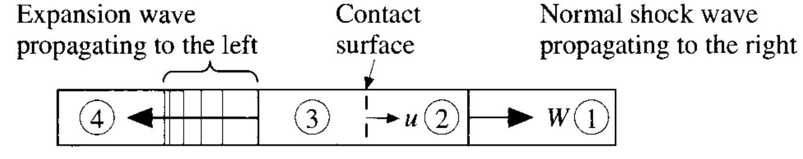
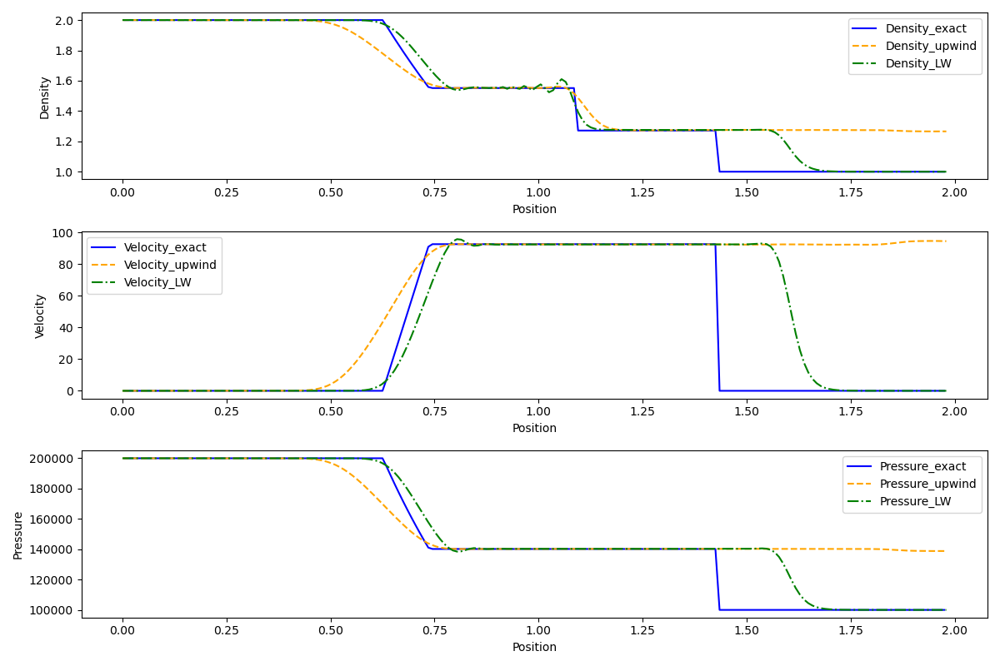

# Riemann-solver
This project come form owner's project reports during studying Advanced Computational Fluid Dynamics (AAE6201-20241-A) in the Hong Kong Polytechnic University.

1-D FDM Riemann solver for sod shock tube and 2-D FVM Riemann solver for bow shock. 




For more information please refer to ```./doc```.
